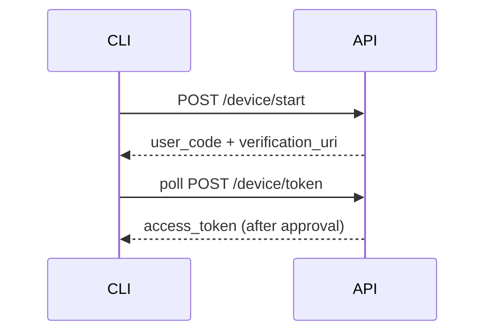

# Documentation

This file governs everything written about code: doc comments and inline comments inside source files, and the supporting documents around them — READMEs, guides, ADRs, changelogs, diagrams, and the structure of the docs folder itself. It also defines how documentation stays truthful: generated from source where possible, type-checked where it contains code, and deleted when it goes stale. Lint-level enforcement of comment rules belongs to `security-and-linting.md`; tests as executable specification belong to `testing-tdd.md`; module and folder layout of source code belongs to `code-organization.md`.

## Quick reference

| ID | Level | Rule |
| --- | --- | --- |
| DOC-001 | MUST | Document in two layers: in the code and about the code |
| DOC-002 | MUST | Have the code's author write its documentation |
| DOC-003 | MUST | Change docs in the same PR as the code; delete stale docs |
| DOC-004 | MUST | Write full TSDoc on every exported symbol |
| DOC-005 | MUST NOT | Write comments that restate what the code does |
| DOC-006 | SHOULD | Generate the API reference from source with TypeDoc |
| DOC-007 | MUST | Type-check every code example in the docs |
| DOC-008 | SHOULD | Follow the standard README section order |
| DOC-009 | SHOULD | Record lasting decisions as ADRs and retire stale ones |
| DOC-010 | MUST | Keep a changelog and semantic versioning for anything others consume |
| DOC-011 | SHOULD | Write diagrams as code |
| DOC-012 | SHOULD | Document non-goals explicitly |
| DOC-013 | SHOULD | Structure docs for LLM retrieval |
| DOC-014 | MUST | Mark deprecations with @deprecated and a migration path |

## Rules

### DOC-001 MUST: Document in two layers: in the code and about the code

**Why:** Symbol-level questions ("what does this parameter accept?") and project-level questions ("why does this service exist, how do I run it?") have different readers and different lifetimes; conflating them produces docs nobody can find.

Maintain both layers deliberately:

- **In-code documentation** — TSDoc on exports (DOC-004) and inline comments explaining intent (DOC-005). It travels with the source, is versioned with it, and is the layer tooling can extract (DOC-006).
- **Supporting documentation** — README (DOC-008), guides, ADRs (DOC-009), changelog (DOC-010), diagrams (DOC-011). It answers questions no single symbol can: purpose, setup, operations, decisions.

Every piece of knowledge gets exactly one home; the other layer links to it rather than duplicating it. Small single-person projects survive on layer one alone, but projects grow past that point without warning — establish both layers from the start on anything intended to outlive its first author or team.

### DOC-002 MUST: Have the code's author write its documentation

**Why:** Context is at its richest at authoring time; a later writer (or a docs team) can only document observable behavior and must guess at intent, constraints, and rejected alternatives — exactly the parts documentation exists to preserve.

The engineer or agent who writes the code writes its doc comments, updates the affected supporting docs, and records any ADR the change warrants — as part of the implementation task, not as deferred follow-up. "Docs later" and "docs sprint" backlogs are where intent goes to die; treat missing docs as an incomplete implementation, the same as missing tests.

### DOC-003 MUST: Change docs in the same PR as the code; delete stale docs

**Why:** Documentation that contradicts the code is worse than no documentation — readers (human and LLM) act on it with confidence. The only reliable sync mechanism is atomicity: docs and code change together or the PR is incomplete.

When a change alters behavior, configuration, or public API, the same PR updates every doc that describes it: TSDoc, README sections, guides, diagrams, example snippets. When a feature is removed or a doc no longer matches reality and nobody will fix it now, **delete the doc** — do not keep it "for reference" or mark it "possibly outdated." Version control preserves history; the working tree must contain only true statements.

**Exception:** A large documentation restructure may land as its own PR, but the triggering code PR must at minimum delete or clearly flag the content it invalidated.

### DOC-004 MUST: Write full TSDoc on every exported symbol

**Why:** Exports are contracts consumed without reading the implementation; the doc comment is the only place the contract's intent, edge cases, and failure modes are stated. It also powers editor hovers and the generated reference (DOC-006).

Every `export`ed function, class, type, interface, and constant carries a TSDoc block that states **what it does and why it exists** (not how), plus the applicable tags: `@param` for each parameter, `@returns`, `@throws` for each error the caller must handle, and `@example` for anything non-obvious. Example code inside `@example` is subject to DOC-007.

**Do:**

```ts
/**
 * Parses a duration string into milliseconds.
 *
 * Accepts integer values only — fractional durations are rejected so
 * schedulers downstream never receive sub-millisecond precision.
 *
 * @param input - Duration in `<number><unit>` form; units: `ms`, `s`, `m`, `h`, `d`.
 * @returns The duration in milliseconds.
 * @throws {RangeError} If the unit is unknown or the value is negative.
 * @example
 * parseDuration("5m"); // 300_000
 */
export function parseDuration(input: string): number {
```

**Don't:**

```ts
// parses duration
export function parseDuration(input: string): number {
```

**Exception:** Exports tagged `@internal` (excluded from the public reference) may carry a one-line comment instead of the full tag set. Re-exports inherit the documentation of the original symbol.

### DOC-005 MUST NOT: Write comments that restate what the code does

**Why:** The code already says what it does; a comment repeating it adds reading cost, drifts silently when the code changes, and buries the comments that matter. The reader can see *what*; only the author knows *why*.

Comments exist to capture what the code cannot express: intent, constraints, invariants, external facts (API quirks, spec requirements, performance cliffs), and rejected alternatives. Internal (non-exported) code is commented **only** where the why is not obvious from the code itself — well-named internal code frequently needs no comments at all. If a comment is needed to explain *what* a block does, rename or extract instead (see `code-organization.md`).

**Do:**

```ts
// Stripe idempotency keys expire after 24h, so a stored key older than
// that must be regenerated, not reused.
if (Date.now() - key.createdAt > DAY_MS) {
  key = regenerateIdempotencyKey();
}
```

**Don't:**

```ts
// check if key is older than a day and regenerate it
if (Date.now() - key.createdAt > DAY_MS) {
  key = regenerateIdempotencyKey();
}
```

### DOC-006 SHOULD: Generate the API reference from source with TypeDoc

**Why:** A reference extracted from the source at build time cannot drift — every version of the code ships with exactly matching docs, and DOC-004's TSDoc investment is paid back automatically. Hand-maintained signature listings are invalidated by every refactor.

Point TypeDoc at the package's public entry points, exclude `@internal` symbols, and build the reference in CI so broken doc comments fail the pipeline. Never write API signatures into markdown by hand.

**Do:**

```jsonc
// typedoc.json — the reference is rebuilt from source on every release
{
  "entryPoints": ["src/index.ts"],
  "out": "docs/api",
  "excludeInternal": true,
  "validation": { "notExported": true, "invalidLink": true }
}
```

**Don't:**

```bash
# Hand-edited signature listing that no tool regenerates — drifts on the next refactor
git add docs/API.md
```

**Exception:** An application with no consumable API surface (nothing imported by outside code) needs no generated reference; DOC-004 still applies to its internal package boundaries.

### DOC-007 MUST: Type-check every code example in the docs

**Why:** Examples are the most-copied code in any project; a snippet that no longer compiles teaches every reader a wrong API and erodes trust in all remaining docs.

Every TypeScript snippet in READMEs, guides, and `@example` tags must pass the compiler. Pick one enforcement mechanism and wire it into CI: keep examples as real files under `docs/examples/` compiled by a dedicated tsconfig (and import them from tests where behavior matters), or use a snippet checker (e.g. twoslash-style doc snippet verification) that extracts fenced blocks and type-checks them. Running snippets with `tsx` additionally proves they execute, but does not satisfy this rule — `tsx` strips types via esbuild without checking them, so a snippet can run and still fail the compiler.

**Do:**

```ts
// docs/examples/basic-usage.ts — compiled by `tsc -p tsconfig.docs.json` in CI,
// then embedded into the README by reference
import { createClient } from "@acme/sdk";

export const client = createClient({ baseUrl: "https://api.example.com" });
```

**Don't:**

```ts
// Fenced block in the README, checked by nothing — the class was renamed months ago
const client = new Client("https://api.example.com");
```

**Exception:** A snippet that deliberately demonstrates a compile error must be labeled as such and should carry the expected diagnostic (e.g. via `// @ts-expect-error`), so the checker verifies it fails for the documented reason.

### DOC-008 SHOULD: Follow the standard README section order

**Why:** A predictable structure lets both newcomers and agents find setup and usage answers without scanning the whole file, and makes gaps (no troubleshooting section, no configuration docs) immediately visible.

Order the README top-down by reader urgency:

1. **What it is** — one paragraph: what the project does, for whom.
2. **Why it exists** — the problem it solves; link the founding ADR if one exists.
3. **Quickstart** — the shortest copy-paste path from clone to running; every command verified.
4. **Usage** — the core workflows, with examples subject to DOC-007.
5. **Configuration** — every environment variable and option: name, type, default, effect.
6. **Scripts** — each `package.json` script worth knowing, one line each.
7. **Troubleshooting** — known failure modes and their fixes, appended as they are discovered.

Keep the README as the router, not the encyclopedia: sections that outgrow a screen move to a dedicated doc under `docs/` with a link left behind (see DOC-013).

### DOC-009 SHOULD: Record lasting decisions as ADRs and retire stale ones

**Why:** Decisions outlive the conversations that produced them; without a written record, future maintainers either relitigate settled questions or cargo-cult constraints whose reasons are gone.

Write an Architecture Decision Record when a choice (a) was made among real alternatives, (b) will constrain future work, and (c) would otherwise live only in chat logs or someone's head — datastore selection, auth strategy, module boundary, wire format, build tooling. Keep ADRs short and numbered (`docs/adr/NNNN-title.md`) with three parts: **context** (the forces in play), **decision** (what was chosen and over what), **consequences** (what becomes easier, harder, or forbidden).

An accepted ADR is immutable; when a decision changes, write a new ADR that names and supersedes the old one rather than editing history. Retire stale ADRs actively: mark superseded ones as such, and delete records describing systems that no longer exist — a decision log full of dead decisions stops being read.

### DOC-010 MUST: Keep a changelog and semantic versioning for anything others consume

**Why:** Consumers of a package, CLI, or API must be able to judge upgrade risk from the version number and a human-written summary — not by diffing source. Without both, every release is a surprise.

For every published artifact: follow semantic versioning — breaking change → major, backward-compatible feature → minor, fix → patch; a `0.x` version explicitly signals an unstable surface where minors may break. Maintain a `CHANGELOG.md` with one dated section per release, grouped by kind (Added / Changed / Deprecated / Removed / Fixed / Security), per keepachangelog.com, with **breaking changes listed first and marked**, each entry naming the migration step it demands. The changelog entry is written in the PR that makes the change (DOC-003), not reconstructed at release time.

In a changesets-managed monorepo (see `monorepo.md` MONO-014), the changeset file authored in the change PR is the changelog entry — it satisfies the written-in-the-PR requirement — and the changesets-generated `CHANGELOG.md`, grouped by bump level at release time, is accepted for published packages in place of the Keep a Changelog grouping.

**Exception:** A continuously deployed internal application with no external consumers may rely on PR history instead of a changelog; the moment anything external depends on its API or CLI, this rule applies in full.

### DOC-011 SHOULD: Write diagrams as code

**Why:** A diagram stored as text diffs, reviews, and merges like any other source file; a binary image drifts invisibly because nobody can see what changed or regenerate it.

Express architecture, sequence, and state diagrams in a text notation — Mermaid by default, since it renders directly in GitHub, most doc sites, and markdown tooling — and commit the source in the doc itself. Update diagrams under the same-PR rule (DOC-003).

**Do:**



**Don't:**

```bash
# A binary export nobody can diff, review, or regenerate
git add docs/architecture-final-v2.png
```

**Exception:** For diagram types the text notation cannot express, commit the editable source file of the drawing tool (e.g. an `.excalidraw` JSON) next to the exported image, so the diagram remains regenerable and reviewable.

### DOC-012 SHOULD: Document non-goals explicitly

**Why:** A stated non-goal is the only thing that distinguishes "deliberately excluded" from "not built yet." Without it, scope creeps in through well-meaning PRs and reviewers (and agents) waste effort proposing what was already rejected.

Give the README and every design doc a **Non-goals** section listing what the project or feature deliberately does not do, each with a clause of reasoning: "Windows native support — WSL2 only; the CLI's file-permission model assumes POSIX." "Realtime sync — polling is sufficient at current scale and removes a server dependency." When a non-goal is promoted into scope, remove it from the list in the same PR that builds it (DOC-003), and record the reversal as an ADR if the original exclusion was one (DOC-009).

### DOC-013 SHOULD: Structure docs for LLM retrieval

**Why:** Agents load documentation selectively under a context budget; a monolithic doc forces loading everything to find one rule, and unstable headings break every stored citation. Docs structured as an index plus focused files serve humans and machines with the same artifact.

Apply four properties to any docs folder (this standards guide itself is the pattern):

- **Router first** — a top-level index (e.g. `AGENTS.md` or `docs/README.md`) listing every doc with a one-line description and, where useful, the task conditions under which to load it.
- **Single-topic files** — each file covers one concern completely; a reader loading only that file gets everything on the topic and nothing else. Split files that accumulate a second topic.
- **Stable IDs** — give rules, sections, and decisions permanent identifiers (`DOC-007`, `ADR-0042`) that survive retitling and reordering, so cross-references and agent citations never rot.
- **Self-contained units** — write each section so it can be quoted alone and still be actionable: no "as mentioned above," no context that lives only in a sibling section.

When the docs are published as a website, additionally serve an `/llms.txt` index per llmstxt.org — a markdown index of the docs with one-line descriptions, the web-facing equivalent of the router file. It is a community convention with meaningful adoption among developer-documentation sites, not a formal standard, and consumption by LLM tooling is uneven — treat it as a low-cost by-product of the router file, not a retrieval guarantee.

### DOC-014 MUST: Mark deprecations with @deprecated and a migration path

**Why:** A bare deprecation warns without helping — consumers see the strikethrough in their editor but must reverse-engineer the replacement. The tag is read at the exact moment the reader needs the migration, so put the migration in the tag.

Every deprecated export carries a `@deprecated` TSDoc tag stating: since which version, what to use instead (as a `{@link}` so it stays checkable), and when it will be removed. The removal itself follows semantic versioning (DOC-010) — deprecate in a minor, remove in a major — and the deprecation is announced in the changelog entry of the release that introduces it.

**Do:**

```ts
/**
 * @deprecated Since 3.2.0 — use {@link createClient} instead; `makeClient`
 * will be removed in 4.0.0.
 */
export const makeClient = createClient;
```

**Don't:**

```ts
/** @deprecated */
export const makeClient = createClient;
```
